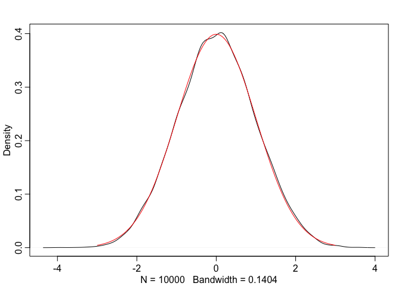
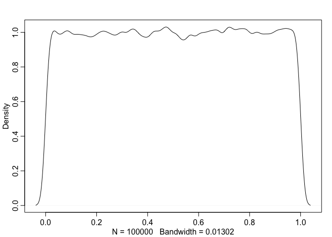

It's relatively straightforward (though not easy) to design a random numbers generator that produces random numbers uniformly. What about generating random numbers, or samples, from an arbiutrary distribution, such as Normal distribution.

Below I'll explore various methods to generate samples from the standard normal distribution $N(0, 1)$, also known as a *standard* normal distribution provided we have access to a *uniform* random numbers generator. If we can create samples for a standard normal distributin, we can create samples for any normal distribution $N(\mu, \sigma^2)$ by scaling as follows:
$$
    x = x_{starndard} * \sigma + \mu
$$
Assume we have a access to a uniform random numbers generatorl between 0 and 1. We need to translate the uniform numbers to N(0, 1).


# Generate Normal Sample with Central Limit Theorem

The mean of a sample from any distribution approaches Normal as the size of the sample increases.

As little as 10 elements in a sample is sufficient to approximate the normal distrubution quite closely.


```r
library(rethinking)

n = 10000 # The number of normal samples
sample_n = 10 # We will draw samples form the uniform distribution
samples = runif(n = sample_n * n, min = 0, max = 1)
samples_matrix <- matrix(samples, nrow=n, byrow = T)
x <- rowMeans(samples_matrix)
# dens(samples)
mu = 0.5
sigma = sd(samples) / sqrt(sample_n)
normal_x = (x - mu) / sigma
dens(normal_x, adj = 1)

true_normal.x <- seq(-3, 3, length.out = 100)
true_normal.y <- dnorm(true_normal.x, mean=0, sd=1)
lines(true_normal.x, true_normal.y, col="red")
```

<!-- -->

# Inverse Transform Sampling

Inverst transform sampling relies on the fact, that if $X$ a random variable, $F$ is its cumulative distrubtion function (i.e. $F(x)$ is the probability of the value $\le$ x) then $F(x)$ is distributed *uniformly*. Let's test this statement. 


```r
inverse_transform <- function () {
  samples <- rnorm(n = 100000, mean=0, sd=1)
  cdf <- pnorm(samples)
  dens(cdf)
}
inverse_transform()
```

<!-- -->

To sample from any distribution with a known cumulative distribution function $F$, we need to calculate it's inverse, generate a *uniform* sample $u$, then we can get the sample from our target distribution as follows:
$$
  x = F^{-1}(u)
$$

This method is not very efficient for continuous cases where the $CDF$ doens't have an analytic integral. Normal distribution is one example. Because of this, other methods are more popular.

# Box-Mullter Transform
